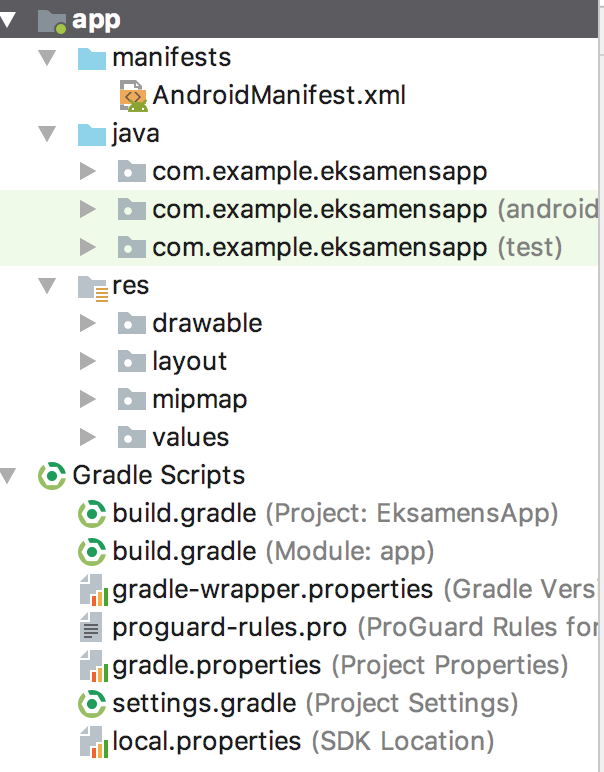
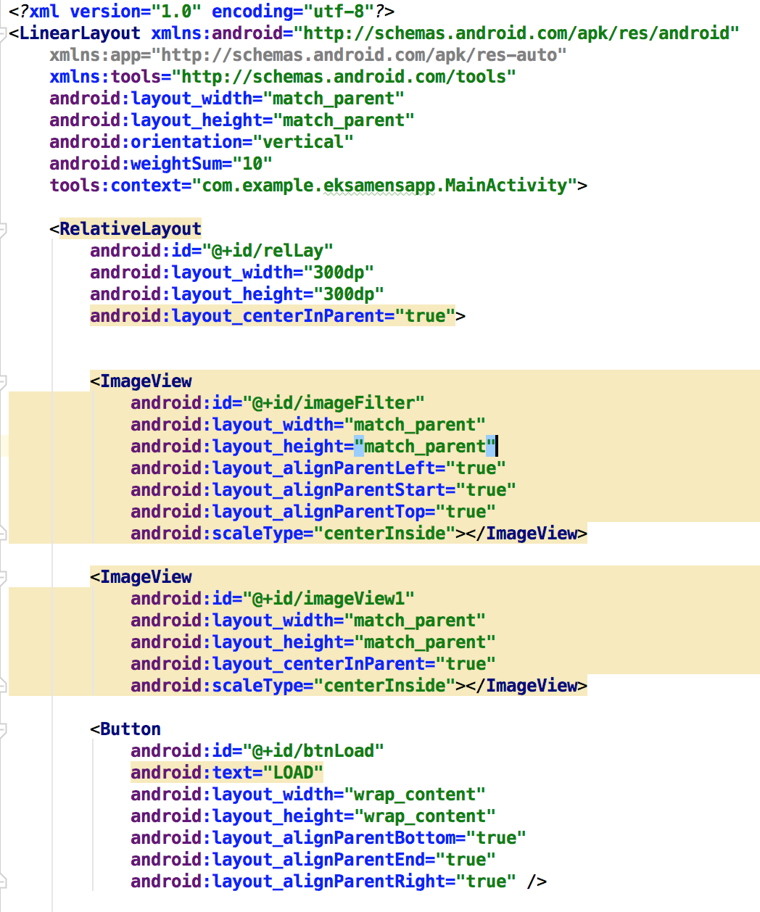
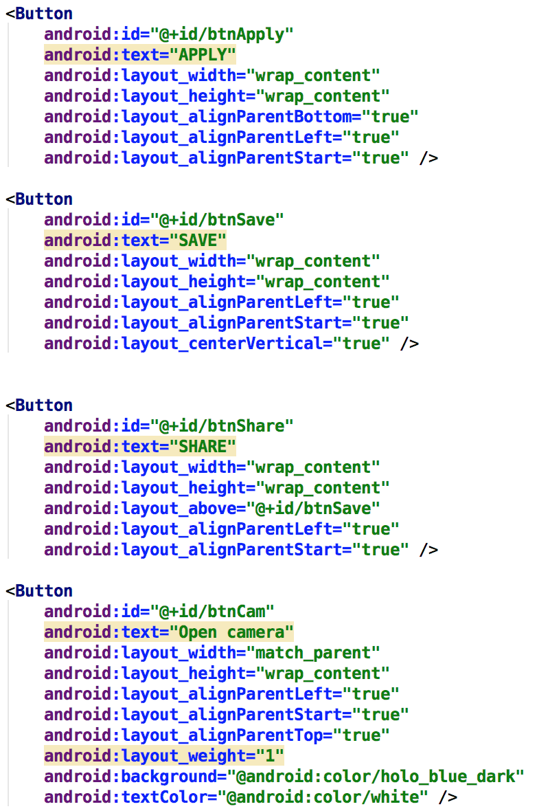
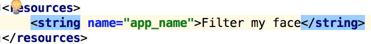
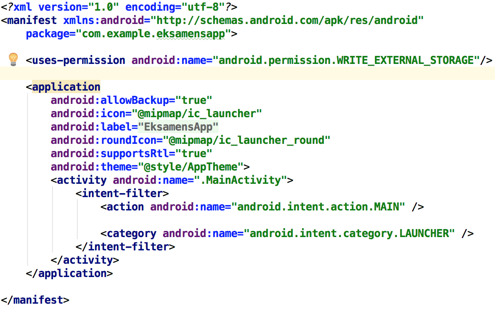
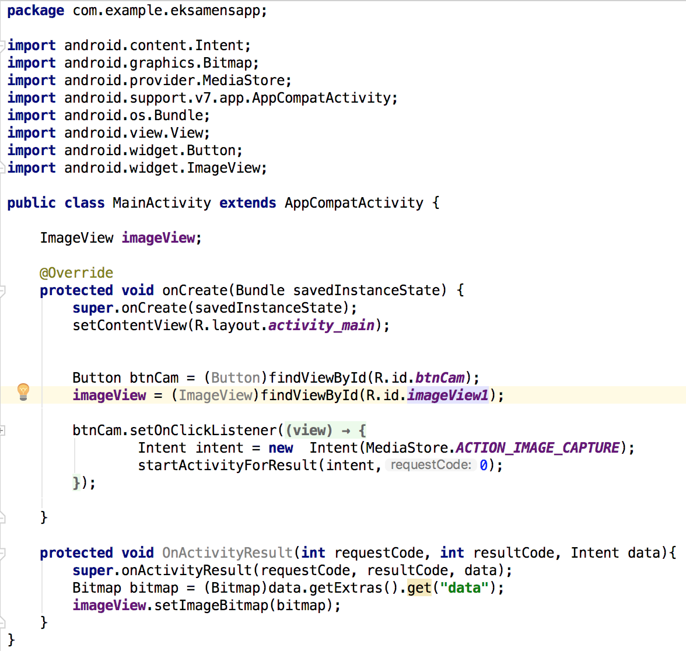

# Filter my face app

## Hvad går denne app ud på?

Denne app har flere formål, har man lyst til at tage et ganske almindeligt billede. Så er denne app en mulighed,

synes man at ansigtet trænger til et lille diCaprio touch så har man muligheden her. Med de 3 indbyggede filtre i appen kan man vælge mellem. Dark effect som giver et mørkt look over billedet. Sun effect som giver et smukt og lysrigt billede så man udstråler, eller nostalgi som er en blanding af nuancer og smukke og stærke farver. 

som udgangs punkt er appen ikke kun beregnet til at tage billeder, og ligge filter oveni. Man skal dog også kunne sende billedet til en ven eller gemme det.

### Kort opsummering af appens funktioner.

1. Appen skal kunne tage billeder.

2. Appen skal kunne gemme billeder i galleri.

3. Appen skal kunne ligge filter på et allerde eksisterende billede i galleri.

4. Appen skal kunne bruge de 3 indbyggede filtre sun effect, dark effect og nostalgi.

5. Appen skal kunne sende et billede med eller uden filter til en ven.

Appen er både en lærings process og et eksamens projekt.

Step 1

For at kunne komme igang, skal man bruge filter. gå ind på google og find nogle billeder, som skal kunne bruges som filter.

Navngiv billederne fornuftigt da det altid er en god ide, og da det bliver nyttigt senere.

OBS billederne skal hede .png tilsidst

Start derefter et helt normalt android studio projekt, når projektet er færdigt burde det således ud.

Når mapperne ser således ud så ved man at projektet ser rigtigt ud herfra kan man gå igang.
Kopier billederne som skal bruges til filter og gå ind på app mappen derefter res -> drawable og paste så billederne ind i mappen, husk på at Stort E af en eller anden grund ikke vil accepteres.

Appen er desværre ikke færdig, så nogle ting bliver udelukket og kan derfor ikke forklares da det ikke er færdigt.

Her ses et billede af activity_main.xml klassen 
Øverst oppe ses det lineare layout og mange andre ting ting som automatisk kommer ind i klassen.
Tilføj et RealiveLayout og giv den et fornuftigt id navn, giv så derefter højde og bredte mål på den.
med disse linjer  

android:layout_width="300dp"

android:layout_height="300dp"

Derefter skal 2 imageViews ind den ene til filteret og den anden til knapperne. gør det samme her bestem højden og bredden med de samme linjer, og giv igen et fornuftigt id og undgå at give dem det samme id, da det kan skabe forvirring og problemer.

Derefter kommer den første knap som vi kalder for load da den skal kunne hente et billede op fra galleri.

Knappen skal have et id, et text felt som viser hvad der står i knappen og højde og breede.

Vi befinder os stadig i activity_main.xml filen, her kan man se resten af de knapper som er nødvendige knapperne er ens på nær id og teksten som står i dem. Den nederste knap, som er den der bruges til at åbne kameraet op med er dog lidt anderledes. Den har farve på, som kan ses på de 2 nederste linjer.

de forskellige navne indikere hvad knapperne kan save kan gemme redigeringen, apply liger filter på, sahre deler med en ven og open camera åbner kameraet.

vil man have et specifikt navn til sin app skal man gå ind på app -> res -> values -> String.xml så vil denne linje komme frem og man kan ændre navnet på appen.

inde i manifest filen skal man huske at ligger permissions, appen vil ikke kunne fungere uden. Her er external storage blevet taget i brug denne permission gør at man kan bruge ting ude fra i sin app så som galleri osv.

 

det sidste billede jeg har er main activty klassen her bliver alle handligner udført vi starter med at lave en instance af knappen, det samme gør vi med image view.
Derefter sætter vi en onclick listener på knappen, så den hele tiden lytter til om knappen bliver trykket på.

## Konklusinon
Appen er ikke færdig udviklet endnu så det er svært rigti t konkludere noget processen indtil nu har været hyggelig og fremadrettet.
